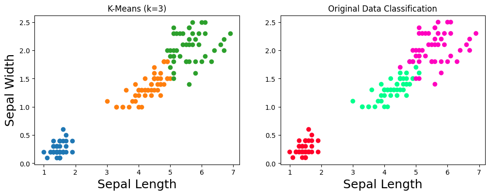
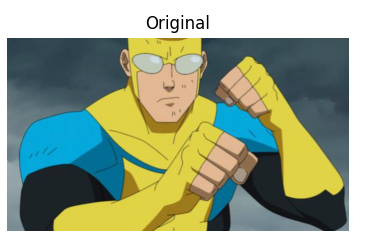
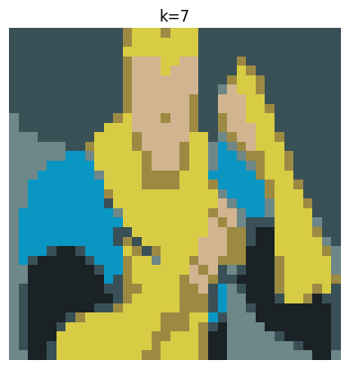
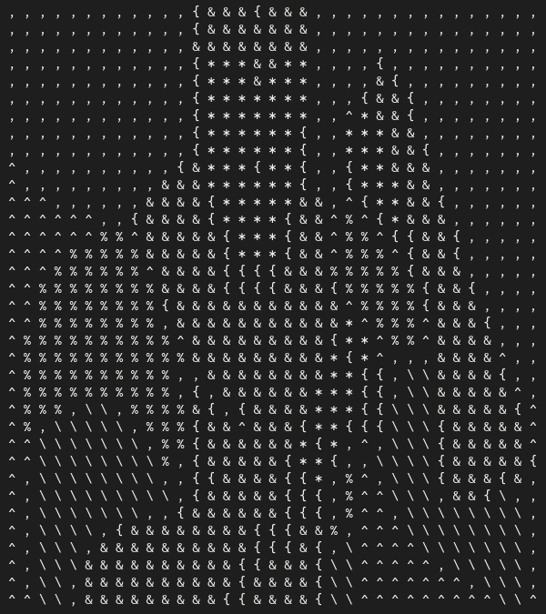

# Image Asciifier

Thought i uploaded this project i made, while having fun implementing my own version of K-Means. I applied this algorithm to compress an image, then make it ASCII with some character replacements.

## K-Means

K-Means clustering is an unsupervised machine learning algorithm which means that we only have inputs and not outputs. It tries to group the data into clusters based on their similarity. Using this algorithm we have to specify the number of clusters we want the data to be divided into. I added a new method to calculate the SSE (Sum of Squared Euclidean distances) to find the initial centroids, to minimize the needed iterations in total.

## Test on the Iris Dataset

Quick 2D implementation for better visualization

## Test on an image from Invincible

Original

Resized image and k-means=7 applied

Asciified image with random characters

